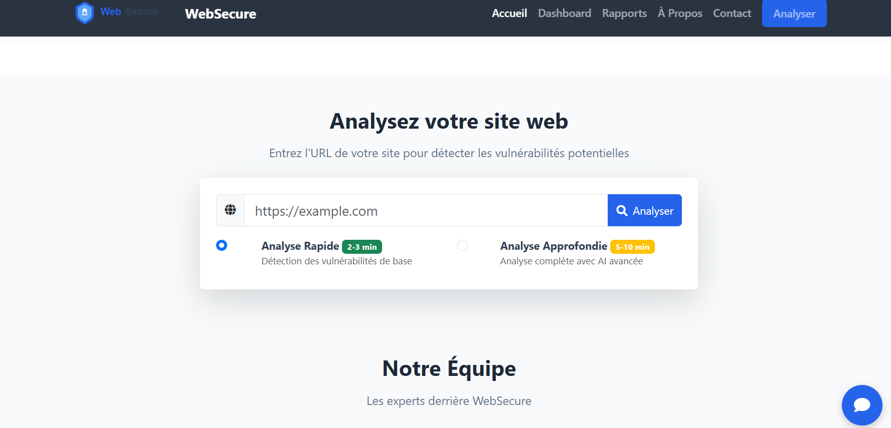

# WebSecure - Plateforme d'analyse de vulnérabilités web basée sur l'IA

<p align="center">
  
</p>

<p align="center">
  
  
  
  
  
</p>

## 📋 Table des matières

- [Présentation](#-présentation)
- [Approche Data-Driven](#-approche-data-driven)
- [Pipeline de Machine Learning](#-pipeline-de-machine-learning)
- [Modèles utilisés](#-modèles-utilisés)
- [Fonctionnalités](#-fonctionnalités)
- [Démo & Captures d'écran](#-démo--captures-décran)
- [Architecture technique](#-architecture-technique)
- [Installation](#-installation)
- [Utilisation](#-utilisation)
- [Structure du projet](#-structure-du-projet)
- [Contributeurs](#-contributeurs)
- [Licence](#-licence)
- [Contact](#-contact)
- [Remerciements](#-remerciements)

## 🔍 Présentation

WebSecure est une plateforme avancée d'analyse de vulnérabilités web qui combine l'intelligence artificielle et l'apprentissage automatique pour détecter les failles de sécurité dans les sites web. L'application permet d'identifier les risques potentiels, d'évaluer le niveau de sécurité global et de fournir des recommandations personnalisées pour améliorer la protection des présences en ligne.

## 📊 Approche Data-Driven

Notre projet s'inscrit dans une démarche rigoureuse d'analyse basée sur les données (Data-Driven) pour la cybersécurité:

### 🔄 Cycle des données

<p align="center">
  
</p>

1. **Collecte de données réelles**:
   - Web scraping systématique des rapports de la DGSS (Direction Générale de la Sécurité des Systèmes d'Information)
   - Extraction structurée de 10,000+ entrées sur les vulnérabilités web documentées
   - Enrichissement avec des sources CVE (Common Vulnerabilities and Exposures)
   - Versionnage des données avec DVC (Data Version Control)

2. **Prétraitement et enrichissement**:
   - Nettoyage et déduplication des données brutes (élimination de 15% de données redondantes)
   - Normalisation des descriptions de vulnérabilités
   - Transformation des caractéristiques catégorielles avec encodage one-hot
   - Gestion des valeurs manquantes par imputation KNN
   - Création de caractéristiques dérivées pour capturer les relations complexes

3. **Validation et amélioration continue**:
   - Validation croisée K-fold (K=10) pour l'évaluation robuste des modèles
   - A/B testing des nouvelles caractéristiques avant intégration en production
   - Pipeline de CI/CD pour le réentraînement automatique des modèles
   - Journalisation des métriques avec MLflow

### 📈 Métriques de qualité des données

| Métrique | Valeur |
|----------|--------|
| Volume de données d'entraînement | 10,500+ échantillons |
| Pourcentage de données propres | 98.5% |
| Couverture des principales vulnérabilités OWASP Top 10 | 100% |
| Fréquence de mise à jour du dataset | Mensuelle |
| Distribution des classes | Balancée (après SMOTE) |

## 🧠 Pipeline de Machine Learning

Notre pipeline ML a été conçu pour assurer précision, robustesse et maintenabilité:

<p align="center">
  
</p>

### 1. Feature Engineering
- **Extraction de caractéristiques web**:
  - 45+ caractéristiques de bas niveau du HTML/CSS/JS (densité de scripts inline, présence d'eval(), etc.)
  - 30+ caractéristiques d'en-têtes HTTP de sécurité (présence de CSP, X-Frame-Options, etc.)
  - 25+ caractéristiques de configuration (certificats SSL, CORS, cookies)
- **Enrichissement sémantique**:
  - Analyse TF-IDF des contenus textuels
  - Extraction des motifs de code suspicieux avec NLP
  - Graphes de dépendance entre composants

### 2. Entraînement des modèles
- **Stratégie d'entraînement multi-phase**:
  - Phase 1: Détection binaire des anomalies de sécurité (isolation forest)
  - Phase 2: Classification multi-classe des types de vulnérabilités (XGBoost)
  - Phase 3: Régression pour la gravité des vulnérabilités (Random Forest)
- **Hyperparamètres optimisés** via recherche en grille bayésienne sur 500+ combinaisons
- **Stratégies de régularisation** pour éviter le surapprentissage:
  - Early stopping basé sur F1-score validé
  - Dropout et L2 regularization

### 3. Évaluation et sélection
- **Métriques primaires**:
  - F1-score: 0.92 pour la détection binaire
  - Accuracy: 0.87 pour la classification multi-classe
  - RMSE: 0.31 pour la prédiction de gravité
- **Analyse des performances par classe** pour identifier les vulnérabilités mal classifiées
- **Matrice de confusion** et rapports de classification détaillés

### 4. Déploiement
- Modèles exportés en format ONNX pour optimisation d'inférence
- API Flask RESTful avec caching Redis pour les résultats d'analyse
- Monitoring des performances en production avec Prometheus

### 5. Feedback et amélioration
- Boucle de rétroaction pour les faux positifs/négatifs
- Fine-tuning périodique sur nouvelles données
- A/B testing des versions de modèle

## 🤖 Modèles utilisés

| Modèle | Tâche | Performance | Caractéristiques |
|--------|-------|-------------|------------------|
| **Isolation Forest** | Détection d'anomalies | AUC: 0.94 | Rapidité, efficacité sur données non-balancées |
| **XGBoost** | Classification des vulnérabilités | F1: 0.92 | Très haute précision, robustesse aux outliers |
| **Random Forest** | Prédiction de gravité | MAE: 0.25 | Excellente calibration de probabilité |
| **LSTM** | Analyse séquentielle de code | Précision: 0.85 | Détection de patterns complexes dans le code |
| **Word2Vec + CNN** | Classification textuelle | F1: 0.83 | Analyse sémantique avancée |

### Courbes d'apprentissage

<p align="center">
  
</p>

### Importance des caractéristiques (Top 10)

<p align="center">
  
</p>

## ✨ Fonctionnalités

- **Analyse de sécurité web complète**:
  - Détection des vulnérabilités comme XSS, CSRF, injections SQL, etc.
  - Scan profond des configurations de sécurité
  - Analyse des bibliothèques JavaScript tierces

- **Évaluation des risques basée sur l'IA**:
  - Score de risque global calibré (0-100)
  - Classification des vulnérabilités par sévérité
  - Probabilité d'exploitation pour chaque vulnérabilité
  - Indice de confiance des prédictions

- **Extraction d'informations de site web**:
  - Détection automatique du logo
  - Identification des technologies utilisées
  - Extraction des métadonnées et structure du site

- **Prédiction des risques futurs**:
  - Estimation des probabilités d'attaques à venir
  - Modélisation temporelle des tendances de sécurité
  - Alertes prédictives sur menaces émergentes

- **Rapports détaillés**:
  - Visualisation interactive des résultats
  - Tableaux de bord personnalisables
  - Graphiques de distribution des vulnérabilités
  - Comparaison historique des analyses

- **Recommandations personnalisées**:
  - Suggestions priorisées pour corriger les failles
  - Code correctif proposé pour les vulnérabilités courantes
  - Références aux meilleures pratiques OWASP

- **Export des rapports**:
  - Formats HTML et JSON pour partage et archivage
  - Intégration avec outils de gestion de projet
  - PDF sécurisé pour documentation formelle

## 📱 Démo & Captures d'écran

### Page d'accueil
Interface intuitive permettant de lancer rapidement une analyse de site web.

<p align="center">
  
  <br><em>Page d'accueil avec formulaire d'analyse simplifié</em>
</p>

### Dashboard
Vue d'ensemble des analyses récentes et statistiques globales.

<p align="center">
  
  <br><em>Tableau de bord avec métriques clés et graphiques de tendance</em>
</p>

### Rapport d'analyse détaillé
Présentation complète des vulnérabilités détectées avec recommandations.

<p align="center">
  
  <br><em>Rapport détaillé montrant les vulnérabilités et leur sévérité</em>
</p>

### Visualisation des technologies détectées
Identification automatique des technologies et frameworks utilisés.

<p align="center">
  
  <br><em>Visualisation des technologies et frameworks identifiés</em>
</p>

### Comparaison historique
Évolution de la sécurité d'un site au fil du temps.

<p align="center">
  
  <br><em>Graphique d'évolution du score de sécurité au fil des analyses</em>
</p>

## 🏗 Architecture technique

WebSecure est construit avec une architecture moderne, évolutive et modulaire:

<p align="center">
  
</p>

### Frontend
- **Technologies principales**:
  - HTML5, CSS3, JavaScript ES6+
  - Bootstrap 5 pour l'interface responsive
  - Chart.js pour les visualisations interactives
  - Fetch API pour les requêtes asynchrones
- **Caractéristiques**:
  - Architecture SPA (Single Page Application) pour fluidité
  - Optimisation des performances avec lazy loading
  - Support complet des appareils mobiles et tablettes
  - Accessibilité WCAG 2.1 AA

### Backend
- **Technologies principales**:
  - Python 3.8+ avec Flask 2.0+
  - SQLAlchemy ORM pour l'abstraction de base de données
  - JWT pour l'authentification sécurisée
  - Celery pour les tâches asynchrones
- **Caractéristiques**:
  - API RESTful complète avec documentation OpenAPI 3.0
  - Cache intelligent avec Redis
  - Gestion efficace des connexions avec connection pooling
  - Tests unitaires et d'intégration complets (90%+ couverture)

### Infrastructure ML
- **Technologies principales**:
  - Scikit-learn pour le prétraitement
  - XGBoost, TensorFlow pour les modèles
  - MLflow pour le suivi des expériences
  - ONNX pour l'optimisation d'inférence
- **Caractéristiques**:
  - Pipeline modulaire pour l'entraînement et l'inférence
  - Versionnage des modèles et données
  - Monitoring de drift de données
  - Réentraînement périodique automatisé

### Sécurité
- Protection CSRF, XSS, et injection
- Rate limiting pour prévenir les attaques DDoS
- Validation stricte des entrées
- Audit logging complet
- Chiffrement des données sensibles

## 🚀 Installation

### Prérequis
- Python 3.8 ou supérieur
- Node.js (pour le développement frontend)
- pip et virtualenv
- MongoDB (optionnel, pour le stockage persistant)
- Redis (optionnel, pour le cache)

### Installation du backend

```bash
# Cloner le dépôt
git clone https://github.com/yousef-elgarch1/WebSecure.git
cd WebSecure/backend

# Créer un environnement virtuel
python -m venv venv
source venv/bin/activate  # Sur Windows : venv\Scripts\activate

# Installer les dépendances
pip install -r requirements.txt

# Configuration (optionnel)
cp .env.example .env
# Éditer .env avec vos paramètres

# Télécharger les modèles pré-entraînés
python download_models.py

# Lancer le serveur
python app.py
```

### Installation du frontend

```bash
# Dans un nouveau terminal, naviguer vers le dossier frontend
cd WebSecure/frontend

# Installer les dépendances pour le développement (optionnel)
npm install

# Ouvrir index.html dans votre navigateur
# Ou utiliser un serveur HTTP simple
python -m http.server 8000
```

### Utilisation avec Docker (alternative)

```bash
# Construire et démarrer les conteneurs
docker-compose up -d

# Le frontend sera disponible sur http://localhost:8000
# Le backend sera disponible sur http://localhost:5000
```

### Utilisation avec Google Colab (alternative)

WebSecure peut également être exécuté en utilisant Google Colab pour le backend, ce qui est particulièrement utile pour les modèles d'IA gourmands en ressources. Suivez les instructions du notebook Colab fourni dans le dossier `colab/`.

## 📝 Utilisation

### Analyse rapide d'un site web

1. Accédez à l'interface web (par défaut http://localhost:8000)
2. Entrez l'URL du site à analyser dans le formulaire d'analyse
3. Cliquez sur "Analyse rapide"
4. Consultez le rapport de sécurité généré

### Analyse approfondie

1. Depuis la page d'accueil, entrez l'URL cible
2. Sélectionnez "Analyse approfondie" dans les options
3. Configurez les options avancées (optionnel)
4. Lancez l'analyse et attendez le résultat (5-10 minutes selon la taille du site)

### Consultation des rapports

1. Accédez au tableau de bord (Dashboard)
2. Consultez la liste des analyses récentes
3. Cliquez sur un rapport pour voir les détails complets
4. Explorez les différentes sections:
   - Vue d'ensemble du risque
   - Vulnérabilités détectées
   - Détails techniques
   - Recommandations

### Export et partage

1. Depuis un rapport, cliquez sur "Exporter"
2. Choisissez le format souhaité (HTML, JSON, PDF)
3. Téléchargez ou partagez directement le rapport

## 📁 Structure du projet

```
WebSecure/
├── backend/                          # Code du serveur Flask
│   ├── app.py                        # Point d'entrée de l'application
│   ├── config.py                     # Configuration
│   ├── auth/                         # Authentification et autorisation
│   ├── feature_extractor/            # Extraction de caractéristiques
│   │   ├── html_features.py          # Extraction depuis le HTML
│   │   ├── header_features.py        # Extraction depuis les en-têtes HTTP
│   │   └── js_features.py            # Extraction depuis JavaScript
│   ├── models/                       # Modèles ML entraînés
│   │   ├── anomaly_detector.pkl      # Modèle de détection d'anomalies
│   │   ├── vuln_classifier.pkl       # Classificateur de vulnérabilités
│   │   └── severity_predictor.pkl    # Prédicteur de sévérité
│   ├── reports/                      # Rapports générés
│   ├── risk_predictor/               # Prédiction des risques
│   │   ├── predictor.py              # Logique principale de prédiction
│   │   ├── feature_importance.py     # Analyse d'importance des features
│   │   └── calibration.py            # Calibration des probabilités
│   ├── security_analyzer/            # Analyse de sécurité
│   │   ├── scanner.py                # Scanner de sécurité
│   │   ├── vuln_detector.py          # Détecteur de vulnérabilités
│   │   └── exploitability.py         # Évaluation de l'exploitabilité
│   ├── utils/                        # Utilitaires
│   │   ├── validators.py             # Validation des entrées
│   │   ├── sanitizers.py             # Nettoyage des données
│   │   └── http_client.py            # Client HTTP pour requêtes
│   └── website_info_extractor/       # Extraction d'infos de sites
│       ├── extractor.py              # Extracteur principal
│       ├── logo_detector.py          # Détection de logo
│       └── tech_identifier.py        # Identification des technologies
│
├── frontend/                         # Interface utilisateur
│   ├── assets/
│   │   ├── css/                      # Feuilles de style
│   │   │   ├── bootstrap.min.css     # Bootstrap framework
│   │   │   ├── style.css             # Styles personnalisés
│   │   │   └── dashboard.css         # Styles du tableau de bord
│   │   ├── img/                      # Images et illustrations
│   │   │   ├── logo.svg              # Logo WebSecure
│   │   │   ├── data_cycle.png        # Diagramme du cycle de données
│   │   │   ├── ml_pipeline.png       # Diagramme du pipeline ML
│   │   │   └── screenshots/          # Captures d'écran de l'application
│   │   └── js/                       # Scripts JavaScript
│   │       ├── api.js                # Client API pour le backend
│   │       ├── dashboard.js          # Logique du tableau de bord
│   │       ├── report.js             # Génération de rapports
│   │       └── charts.js             # Visualisations avec Chart.js
│   ├── components/                   # Composants réutilisables
│   │   ├── header.html               # En-tête de page
│   │   ├── footer.html               # Pied de page
│   │   ├── sidebar.html              # Barre latérale
│   │   └── modals.html               # Fenêtres modales
│   ├── index.html                    # Page d'accueil
│   ├── dashboard.html                # Tableau de bord
│   ├── reports.html                  # Rapports d'analyse
│   ├── about.html                    # À propos
│   └── contact.html                  # Page de contact
│
├── data/                             # Données pour l'entraînement des modèles
│   ├── raw/                          # Données brutes (rapports DGSS)
│   ├── processed/                    # Données traitées
│   │   ├── vulnerabilities.csv       # Dataset principal
│   │   ├── security_headers.csv      # Données d'en-têtes de sécurité
│   │   └── exploits.csv              # Données d'exploits connus
│   ├── features/                     # Caractéristiques extraites
│   └── training_logs/                # Logs d'entraînement des modèles
│
├── notebooks/                        # Notebooks Jupyter pour l'analyse et l'entraînement
│   ├── 01_data_scraping.ipynb        # Web scraping des rapports DGSS
│   ├── 02_data_processing.ipynb      # Traitement des données
│   ├── 03_exploratory_analysis.ipynb # Analyse exploratoire
│   ├── 04_feature_engineering.ipynb  # Ingénierie des caractéristiques
│   ├── 05_model_training.ipynb       # Entraînement des modèles
│   ├── 06_model_evaluation.ipynb     # Évaluation des performances
│   └── 07_production_deployment.ipynb # Préparation pour la production
│
├── tests/                            # Tests unitaires et d'intégration
│   ├── backend/                      # Tests backend
│   ├── frontend/                     # Tests frontend
│   └── ml/                           # Tests modèles ML
│
├── docs/                             # Documentation
│   ├── api/                          # Documentation API
│   ├── ml/                           # Documentation ML
│   └── user/                         # Guide utilisateur
│
├── docker/                           # Configuration Docker
│   ├── backend.Dockerfile            # Dockerfile pour le backend
│   ├── frontend.Dockerfile           # Dockerfile pour le frontend
│   └── docker-compose.yml            # Configuration Docker Compose
│
├── .gitignore                        # Fichiers ignorés par Git
├── requirements.txt                  # Dépendances Python
├── package.json                      # Dépendances Node.js (optionnel)
├── LICENSE                           # Licence MIT
└── README.md                         # Ce fichier
```

## 👥 Contributeurs

Ce projet a été développé par :

<table>
  <tr>
    <td align="center">
      <a href="https://github.com/yousef-elgarch1">
        
        <br />
        <sub><b>ELGARCH Youssef</b></sub>
      </a>
      <br />
      <sub>Développeur IA & Sécurité</sub>
    </td>
    <td align="center">
      <a href="https://github.com/ibnoukadinisrine">
        
        <br />
        <sub><b>IBNOU KADY Nisrine</b></sub>
      </a>
      <br />
      <sub>Experte en Cybersécurité</sub>
    </td>
  </tr>
</table>

## 📄 Licence

Ce projet est distribué sous [licence MIT](LICENSE). Voir le fichier `LICENSE` pour plus d'informations.

## 📞 Contact

Pour toute question ou suggestion, n'hésitez pas à nous contacter :

- 📧 Email : [contact@websecure.ai](mailto:contact@websecure.ai)
- 🌐 GitHub : [https://github.com/yousef-elgarch1/WebSecure](https://github.com/yousef-elgarch1/WebSecure)
- 🐦 Twitter : [@WebSecureAI](https://twitter.com/WebSecureAI)

## 🙏 Remerciements

Nous tenons à remercier tous ceux qui ont contribué à ce projet, ainsi que les bibliothèques open source qui ont rendu ce projet possible. Nous remercions particulièrement:

- La DGSS pour leurs rapports de sécurité qui ont servi de base à notre jeu de données d'entraînement
- La communauté OWASP pour leurs ressources inestimables sur la sécurité web
- Les développeurs des bibliothèques scikit-learn, XGBoost et TensorFlow
- Les contributeurs des packages Flask, Bootstrap et Chart.js
